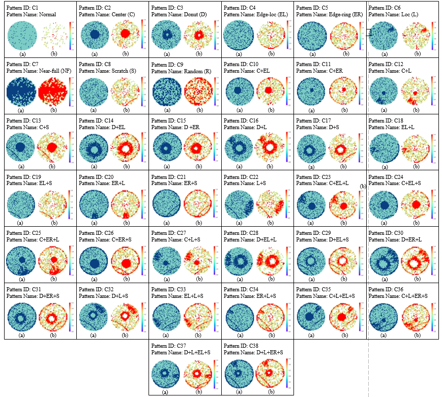

# WaferMap

Wafer Bin Map DataSet(WaferMap) has more than 36000 wafer maps, including 1 normal pattern, 8 single defect pattern, and 29 mixed defect pattern, a total of 38 defect pattern.

## Requirements:

Python 3+

numpy scipy matplotlib tensorflow keras scikit-learn

## Instructions：
Download and process the data in [data_mutil_label.npz](https://pan.baidu.com/s/19aEazgpLMBPBzjePSCTgHw) Extraction code: mrpm

To train a model, run [train_mutil_label.py](train_mutil_label.py)

## WaferMap pattern Show:
The picture introduces 38 wafer pattern and the corresponding feature map after using Deformable Convolution

